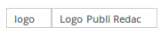
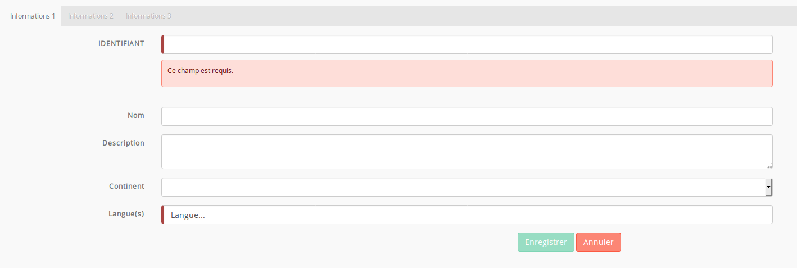
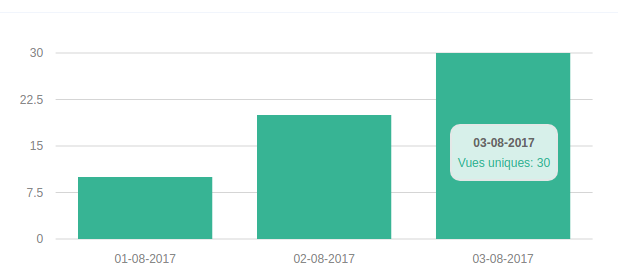
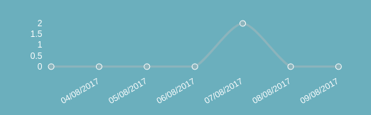
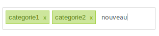

**SDV** Ng2 Widget est un pack de widget adapté pour bootstrap en angular2

Les widgets génériques sont définis dans le paquet [sdv-ng2-widgets](https://gitlab.sdv.fr/rnd/sdv-ng2-widgets)

# Autocomplete


Le composant d'autocomplete doit être appelé de la façon suivante:

    <autocomplete [config]='...' [data]='...' (valid)="function($event)"></autocomplete>

* **[data]**: *Array* - tableau contenant les données à traiter par l'autocomplete
* **[config]**: *Object* - permet la config du widget, doit contenir:
    * **fieldDisplayed**: *String|Array* - nom du ou des attributs du tableau *data* qui sont utilisés à l'affichage dans le champ
    * **fieldSearch**: *String* - nom de l'attribut du tableau *data* dans lequel effectuer la recherche (si vide, on prend le fieldDisplayed)
    * **fieldValue**: *String* - nom de l'attribut du tableau *data* qui fait office de valeur de retour par le widget (si vide, on renvoi l'objet complet)
    * **fieldInsert**: *String* - nom de l'attribut du tableau *data* qui remplacera le placeholder après un clic sur l'un des résultats (si vide, on insert le fieldDisplayed)
    * **fieldDefault**: *String* - La chaîne affichée lorsque aucune valeur n'est sélectionnée. Vaut Aucun par défault
    * **begin**: *Number* - nombre de caractères à entrer dans le champ avant que l'autocomplete ne se lance
    * **defaultValue**: *String* - valeur par défaut à insérer dans l'input d'autocompletion
    * **placeholder**: *String* - Placeholder du champ
    * **modifyPlaceholder**: *Boolean* - Si true, alors le placeholder prends la valeur du champs sélectionné. Vaut true par défaut.
    * **displayItem**: *Boolean* - Si true, alors on affiche les différents élements que l'on ajoute à droite du placeholder. Vaut false par défaut.
    * **displayItems**: *Array* - Tableau qui contient les différents élements à ajouter à droite du placeholder.
    * **displayItemClass**: *String* - Classe CSS pour les élements à afficher à droite du placeholder.
    * **onlyShowDisplayItems**: *boolean* - Si true, on affiche pas l'autocomplete mais uniquement les items définis dans displayItems (ne pas oublier de configurer **fieldDisplayed**)
    * **customSearch**: *Void* - Fonction personnalisée pour effectuer une recherche sur des données distantes. (Doit renvoyer un Observable)
    * **scope**: A utiliser avec customSearch, permet de définir la portée de la fonction.
* **(valid)**: *Function* - fonction appelée lorsque le champ est validé sur un resultat existant.
* **(create)**: *Function* - fonction appelée lorsqu'on fait "ENTREE" sur un texte inexistant.
* **(delete)**: *Function* - fonction appelée lors de la suppression d'un résultat.
* **[disabled]**: *boolean* - si true alors l'autocomplete passe dans l'état disabled.

# AutocompleteDisplayItems
Ce widget est utilisé dans le widget autocomplete, cependant, il est possible de l'utiliser sans passer par l'autocomplete. Exemple :

  <autocomplete-display-items [class]="'badge'"
                              [items]="[...]"
                              [field]="'name'"
                              [disabled]="false"
                              (delete)="deleteItem($item)">
  </autocomplete-display-items>
  
Voici sa configuration :
  
  * **[class]**: *string* - la classe CSS à appliquer aux différents items
  * **[items]**: *Array* - les différents items qu'il faut afficher
  * **[field]**: *string* - le champ à afficher pour nos items
  * **[disabled]**: *boolean* - si true, alors on ne pourra pas supprimer les items
  * **(delete)**: *Function* - fonction appelée lors du clic sur la croix pour supprimer
  


# BigDatatable
Ce composant est une solution alternative au composant Datatable. Il permet de gérer une grande quantité de données.
Il utilise le composant **Pager** et le composant **Filtre**, cependant il peut fonctionner sans ceux-ci.
Il est possible de le configurer de tel sorte qu'un filtre soit présent en haut de page, qu'une pagination soit présente en bas et/ou haut de page.
Pour un bon fonctionnement de ce composant, il est néanmois conseillé de disposer d'au moins une pagination.

Ce composant renvoie en valeur de output : (message), qui vaut success ou error selon si on a réussit ou non à récupérer les informations côté serveur.

La configuration est la suivante :

* **bigdata**
    * **_service** : Le service qui s'occupera d'aller chercher les données sur le serveur.
    * **_service_method : La fonction qui est appellée par le **_service** pour récupérer les données.
    * **filter_has_display_items** - **boolean** - **default = false** : Si true, alors on peut changer le nombre d'élement par page dans le filtre
    * **display_items_name** - **string** - **default = display_items** : Nom du champs qui contient le nombre d'élement par page dans le filtre (sa **key**).
    * **is_filter** - **boolean** - **default = true** : Si false, alors on a pas de filtre.

    * **can_sort** - **boolean ** - **default = false** : Si true, alors on peut trier les colonnes.
    * **sort** - **object** - **FACULTATIF** :
        * **field** - **string** - **default = ''** : Le nom du champs sur lequel appliquer le tri lors du chargement.
        * **asc** - **boolean** - **default = true** : Si false alors le tri est décroissant.

    * **filter_config** - **Array** : Correspond à **config** de **Filtre**. Voir sa configuration.
    * **tr** -Object** : Contient soit une propriété :
        * **class** : La classe à appliquer sur les tr
        * **function** : Une fonction qui sera appliquée sur **parent_scope** qui renvera la classe à appliquer sur le tr.
        * **rowCallback** : Une fonction qui sera appliquée lors du clic sur une ligne.
    * **pagination_config** - **Array** - **FACULTATIF** : Si non renseignée, la pagination par défaut sera appliquée.
        * **pagination_top** - **boolean** - **default = false** : Si true, alors on aura une pagination en haut de page.
        * **pagination_bottom** - **boolean** - **default = true** : Si true, alors on aura une pagination en bas de page.
        * **page** - **number** - **default = 1**: La page courante.
        * **max_page** - **number** - **default = 1** : Le nombre de page qu'il y a en tous.
        * **delta** - **number** - **default = 5** : Le nombre de page précédent et suivant **page** que l'on vera à l'écran.
        * **item_per_page** - **number** - **default = 10** : Le nombre d'élement que l'on veut afficher sur chaque page.

    * **buttons** - **Array** - **FACULTATIF**: Tableau de tableau contenant les boutons. Un tableau se compose de la façon suivante :
        * **text** - **string** : Le texte qui sera dans le boutons, peut être du HTML.
        * **class** - **string** : La classe qui sera associé au bouton.
        * **action** : La méthode qui sera appellée lors du clic sur le bouton. Sera appliquée sur **parent_scope**

* **parent_scope** : Le composant parent.

* **structure** - **Array** : Correspond à la structure des colonnes. Chaque colonne peut être configurée différement,
plusieurs types de colonne existent, pour les différencier un attribut **state** a été mit en place. Cet attribut peut avoir plusieurs valeurs :
* 1 est l'état "normal", ou le contenu sera affiché tel quel dans la cellule.
* 2 est l'état "html", ou le contenu est sous forme HTML.
* 3 est l'état "avancé", une fonction est déclenché lors du clic sur l'élement.

Chaque colonne est matérialisée par un tableau dans **structure**, les propriétés communes pour ces tableaux sont les suivantes :
* **id** - **string** : Correspond à la propriété de l'objet qui sera contenu dans la big-datatable.
* **label** - **label** : Correspond au titre de la colonne.
* **size** - **number** - **FACULTATIF** : Correspond à la taille en % de la colonne (attention seul les valeurs 1,2,3,5,7,15,20,25 sont mises en place).
* **state** - **number** - **default = 1** : Correspond à l'état de la cellule tel que décris ci-dessus.

Propriété supplémentaire selon l'état :
* **state == 1 || state == 2** : On peut lui passer une pipe en paramètre, pour ce faire :
    * **pipe** : C'est l'objet Pipe qu'on lui passe.
    * **params** : C'est les paramètres à passer à **pipe**.
    * **pipe_async** - **boolean** : Permet de signifier qu'un pipe est asynchrones.
    * **pipe_async_field**- **string** : Si le pipe asynchrone renvoie un objet, le champ précisé ici sera affiché.

* **state == 3** : On peut lui passer une fonction qui se déclenchera lors du clic sur lui et également split la value de la cellule.
    * **function_type** - **string** : Vaut soit 'normal', soit 'split', soit 'content'. Si split, on doit passer un separator en paramètre.
    * **separator** - **string** - **OBLIGATOIRE SI function_type == 'split'**: Le séparateur pour le split sur la valeur de la cellule.
    * **class** - **string** : Une classe CSS à appliquer sur le contenu de la cellule.
    * **function** :
        * Si function_type vaut 'split' ou 'normal', il s'agit de la fonction à appliquer lors du clic sur le(s) élement(s) de la cellule.
        * Si function_type vaut 'content', il s'agit de la fonction à appliquer à l'affichage du contenu de la cellule.

Exemple de structure :

        structure:                                              // La structure du tableau.
        [
            // Champs avec une pipe :
            { id: "url_source",        label: "URL Source",    size: 15, pipe: new TruncateWithTooltipPipe, params: 50, state: 2},

            // Champs "normale" :
            { id: 'redirection_label', label: 'Redirection',   size: 11},

            // Champs avec function :
            { id: 'tags_list',         label: 'Tag(s)',        size: 10, function_type: 'split', separator:',', class:'tag_list hover', function: this.addFilterTag, state:3},
        ],


Pour l'instancier :

    import {BigDatatable} from 'sdv-ng2-widgets/_widgets/big-datatable/big-datatable.component';
    [...]
    this.bigdata = new BigDatatable(this.config, this.structure, this.scope);

Les données qui sont postées côté serveur sont un tableau associatif contenant :

array(
    'filter' =>  toutes les données du filtre.
    'pagination' => toute la pagination.
);

Le serveur doit impérativement renvoyer un tableau JSON sous cette forme :

    array('filter' => $filter['filter'],
          'objects' => $res['shortcuts'],
          'pagination' => $filter['pagination']
          )

# Bloc-Card

Bloc de contenu sous forme de carte


    <bloc-card class="col-lg-4" [data]="{type:'divers', title:'Titre de mon paragraphe', content:'Ici on peut raconter plein de chose'}"></bloc-card>

* **title**: pour changer le titre du bloc
* **content**: pour changer le contenu du bloc
* **type**: peut prendre la valeur: paragraphe, image, divers, autre2, autre3 (ceci le fera changer de couleur)

# BreadCrumb ( Fil d'ariane )

Ce widget ne doit s'intégrer qu'une fois dans la page.
Pour son utilisation voir à travers le service [BreadCrumb](#breadcrumb-fil-dariane_1)

# Button 3D

Permet de faire des boutons poussoir en 3d


Utilisation :

    <button3d [icon]="'check'" [class]="'success'" [size]="'btn-sm'" (click)="afficheBootbox('alert')" > Valider</button3d>
    <button3d [icon]="'code-fork'" [class]="'danger'" (click)="afficheBootbox('alert')" > Pousser en prod</button3d>
    <button3d [icon]="'cloud'" [class]="'primary'" [size]="'btn-lg'" (click)="afficheBootbox('alert')" > Envoyer dans le cloud</button3d>

# Chevron

Le widget chevron permet de cacher facilement le contenu d'un bloc


* **hidden** : Input/Ouput: Etat ouvert/fermé du bloc lié (boolean)

Exemple1: Utilisation avec une var locale et le display hidden (caché par la css) :

    <h3>
      <chevron [(hidden)]='contenu.hidden' class="pull-right"></chevron>
      Titre
    </h3>
    <div #contenu>
      Mon contenu a cacher
    </div>

Exemple2: Utilisation avec une var typescript et ngIf (caché par le dom/js):

`public mavar: boolean = false;`

    <h3>
      <chevron [(hidden)]='mavar' class="pull-right"></chevron>
      Titre
    </h3>
    <div *ngIf='mavar'>
      Mon contenu à cacher
    </div>

# CKEditor

Le widget ckeditor permet d'intégrer l'éditeur de texte simplement.


Utilisation :

    <ckeditor [(content)]="article.chapeau" [id]="'chapeau_text'"
              [rows]="4" [disabled]="false" [config]="config1"></ckeditor>

* **content** : Le texte contenu par l'éditeur, lié dans les deux sens afin de  mettre à jour automatiquement la variable dans le composant appelant
* **id**: Un identifiant unique pour l'éditeur.
* **row**: Permet de définir la hauteur de l'éditeur.
* **disabled**: Si il est à true, le ckeditor est remplacé par une div affichant juste le contenu.
                S'il est passé à false par la suite, le ckeditor apparaitra.
* **config**: La configuration de l'éditeur (choix des actions possibles ou non).

Exemple de conf, voir le fichier site/bo_spa/src/app/article/edit/edit.ts

# Corner button

A documenter

# Datatable


Exemple de template:

    <loader [condition]="data_tab">
      <datatable [data]="data_tab" [structure]="structure" [buttons]="buttons" [parent_scope]="scope"></datatable>
    </loader>`

Exemple de component:

    public structure = [
        { id: "id", label: "ID"},
        { id: "name", label: "Nom du champ"}
    ];

    public buttons = [
      {
          text: 'Editer',
          action: this.edit,
          class: "btn btn-warning"
      },
      {
          text: 'Supprimer',
          action: this.confirmDelete,
          class: "btn btn-danger"
      }
    ];
    //scope sur lequel appliquer les fonctions des boutons
    public scope = this;

    //un exemple de données
    public data_tab = [{id: 1, name: "Antoine"}];

Il est également possible de fournir du contenu HTML généré dynamiquement, pour ce faire :

- La définition de la structure est la suivante :

    ```{public structure = [
      { id: "id", label: "ID"},
      { id: "liste_lapins", label: "Mes Lapins", inputHTML: true}
    ];```

- Ensuite, dans mon model :
    1. Ajouter la propriété "liste_lapin".
    2. Générer le HTML qui corresponds.
    3. L'affecter à cette propriété.


Dans mon model

    public lapins: Lapin[]; // Les différents objets Lapin

Dans le constructeur du mode

    this.lapins      = obj && obj.lapins     || null;

    public get liste_lapins() {
        let ul = '<ul>';
        for(let lapin in this.lapins) {
            ul += '<li>' + lapin.name + '</li>';
        }
        return ul + '</ul>';
    }

## Ajout d'une colonne de checkboxes
    
Il est possible d'ajouter comme première colonne une colonne de checkboxes pour ce faire, passer en input **checkboxes**
 qui vaut true et en output **checkedRows**, lors de chaque clic sur une case à cocher les différents élements cochées seront renvoyées.
 
Exemple :

```
    <datatable [structure]="structure"
               [data]="users"
               [parent_scope]="scope"
               [buttons]="buttons"
               [checkboxes]=true
               (checkedRows)="deleteManyArray=$event"
    ></datatable>
```

## Ajout du DragNDrop sur la table

L'input [dragulaFunctions] permet de définir un comportement de DnD.
Pour cela on peut par exemple, préciser des fonction drag,drop,over,out ou dropModel (voir plus de précision)[https://github.com/valor-software/ng2-dragula]

Exemple:
    ```
    <datatable [data]="data_tab" [structure]="structure" [parent_scope]="scope"
    [dragulaFunctions]="{
      dropModel: onDrop
      over: onOver
      out: onOut
      }"
    ></datatable>
    ```

Avec dans mon TS, les fonctions suivantes:

    ```
    public onDrop(value) {
      this.save(this.data_tab);
    }

    public onOver(value) {
      let [val] = value.slice(1);
      HtmlHelper.addClass(val, 'ex-over');
      HtmlHelper.addClass(val, 'gu-transit');
    }

    public onOut(value) {
        let [val] = value.slice(1);
        HtmlHelper.removeClass(val, 'ex-over');
        HtmlHelper.removeClass(val, 'gu-transit');
    }
    ```

Les fonctions sont enregistré sur les méthodes du dragulaService et executée dans le contexte du parent_score.


# DatePicker

Ce widget permet d'afficher un champ de texte qui fait apparaître un calendrier.


Utilisation :

    <datepicker [(ngModel)]="date_publi" view-format="DD/MM/YYYY" model-format="YYYY-MM-DD"
                first-week-day-sunday="false"></datepicker>

* **ngModel**: La valeur de le date.
* **view-format**: Le format de date tel qu'il sera affiché dans le champ de texte.
* **model-format**: Le format de la date tel qu'il est dans la variable.
* **init-date**: Date à placer dans le champ à l'initialisation
* **first-week-day-sunday**: Un booléen permettant de préciser pour l'affichage du calendrier si les semaines doivent commencer le dimanche (true) ou le lundi (false).
* **reset**: Booléen permettant d'afficher un bouton pour réinitialiser la valeur initiale du champ
* **init-empty** : Un booléen permettant de ne pas mettre la date courante par défaut dans le champ si init-date est null

# DropDown

A documenter

# Filtre
Ce composant permet de générer un filtre. Ce filtre possède deux états :
 * un état simple, où seulement un champs de recherche est présent.
 * un état avancé, où plusieurs champs de recherche sont présent selon ce qui a été configuré.

La configuration est la suivante :
* **config**
    * **launch_search_on_init** -**boolean** - **default = true** : Si false, alors la recherche ne sera pas lancée lors du chargement de la page.
    * **advanced_mode** - **boolean** - **default = false** : Si true, alors le filtre sera dans l'état "Filtre avancé".
    * **global_search** - **string** - **default = ''** : Le texte qui est dans l'input de recherche lorsque le filtre es dans l'état "Filtre simple".
    * **callback**      : La fonction qui sera appellée lors de la validation du filtre. Sera appliquée sur **parent_scope**
    * **parent_scope**  : Le composant parent qui contient la méthode **callback**.
    * **config_column** - **Array<number>** : Tableau contenant la taille bootstrap des différentes colonnes.
                                              Par exemple [4,8] => On aura une colonne avec ce style "col-lg-4" et la deuxième aura "col-lg-8".
                                              **Attention le maxium des sommes des colonnes doit faire 12 !!!**
    * **hide_search** - **boolean** - **default = false** : Si true, alors le filtre de recherche globale sera caché lorsqu'on est en recherche avancé.
    * **property** - **Array** : Tableau contenant les différentes propriétés sur lesquelles on peut filtrer.
    * **select_item_per_page** - **object** - **FACULTATIF** : Permet d'avoir une liste déroulante à côté du champs de recherche. Attention, ceci remplace **filter_has_display_items** de la **Bigdatatable** s'il est activé.
        * **values** - **Array** - **OBLIGATOIRE** : Contient les différentes valeurs que l'on peut chosir dans la liste déroulante.
        * **default** - **number** - **FACULTATIF** : Contient la valeur qui sera choisie par défaut dans la liste déroulante.
        * **post_filter** - **boolean** - **FACULTATIF** : Si true, alors **callback** sera appellée lors du changement dans la liste déroulante.
        * **save_in_localStorage** - **boolean** - **FACULTATIF** : Si true, alors on sauvegarde le nombre d'item par page choisit dans le localStorage.
        * **localStorage_name** - **string** - **FACULTATIF** Si **save_in_localStorage** est true, alors le localStorage aura **localStorage_name**. Si pas de nom renseigné, le nom sera : "localStorage_nb_item_per_page".
          ** Pour utiliser le localStorage (à ajouter avant l'instanciation de la bigdatatable) :


                if(this.config.filter_config.select_item_per_page.save_in_localStorage) {
                  let nb_item_per_page = localStorage.getItem(this.config.filter_config.select_item_per_page.localStorage_name); // ou "localStorage_nb_item_per_page" si on a pas défini de nom.
                  if(nb_item_per_page) this.config.filter_config.select_item_per_page.default = +nb_item_per_page;
                }

                this.bigdata = new BigDatatable(this.config, this.config.structure, this.scope);


**property** est un tableau associatif, qui est formé de la manière suivante :
    * **key** : **data (Array)** : **key** est le nom du champ tel qu'il l'est en BDD.

**data** est un tableau contenant les différentes configurations pour le champs **key**. La configuration diffèrent selon le type de champ.
Actuellement les différents champs possible sont :
 * text
 * number
 * autocomplete
 * select
 * date
 * intervalle de date

 Pour chacun de ces types, data doit contenir :
 * **id** - **string** : C'est l'id du champs.
 * **label** - **string** : C'est le label du champs.
 * **type** - **string** : C'est le type du champs. Ce type est un de ceux décrit ci-dessus.
 * **value** - **<any>** : La valeur par défaut de ce champ. Peut être une chaîne, un nombre, un tableau....
 * **column** - **number** : Le numéro de la colonne dans lequel ce champ se trouvera.

 Configuration de data supplémentaire pour **data.type ==**:
 * **text** : AUCUNE.

 * **number** :
    * **min** - **number** - **FACULTATIF** : La valeur minimum possible pour ce champ.
    * **max** - **number** - **FACULTATIF** : La valeur maximal possible pour ce champ.

 * **autocomplete** :
    * **config** - **Array** =====> Se référer à la documation concernant le widget "Autocomplete".
    * **delete** : La méthode qui sera délenchée lors de la suppression d'un élement de l'autocomplete.
                   Cette méthode sera appliquée sur **parent_scope** (celui du filtre).
    * **add** : La méthode qui sera déclenchée lors de l'ajout d'un élement de l'autocomplete.
                Cette méthode sera appliquée sur **parent_scope** (celui du filtre).
    * **data** : Les données qui seront fournies à l'autocomplete.

 * **select** :
    * **propositions** - **Array** - Tableau d'objet qui contient les différents élements à insérer dans le select.
                                     Ce tableau doit correspondre au format suivant : { label: 'label', id : 'id' }, où id est la value.
    * **default_label** - **string** - **FACULTATIF** : Le label de la proposition par défaut.
    * **default_value** - **any**    - **FACULTATIF** : La valeur de l'option par défaut.

 * **date** : Aucune, par contre **value** doit être une date au format **YYYY-MM-DD** !

 * **date-intervale** : Aucune, par contre **value** doit être composé comme ça :
    * **{'min' : '2000-01-01', 'max': '2015-05-05'}** où **min** et **max** sont au format **YYYY-MM-DD**.


# FormBuilder
Ce widget permet à l'aide d'un tableau d'objet de créer un formulaire sur une page avec ou sans onglet.

Les types de champs pris en compte sont les suivants :
 * **[autocomplete](#autocomplete)**
 * **[checkbox](#checkboxes)**
 * **[checkboxes](#checkboxes)**
 * **[ckeditor](#ckeditor)**
 * **[datepicker](#datepicker)**
 * **[dynamic](#dynamic)**
 * **[email](#email)**
 * **[number](#number)**
 * **[password](#text)**
 * **[radios](#radios)**
 * **[select](#select)**
 * **[text](#text)**
 * **[textarea](#textarea)**
 * **[url](#url)**

De base, chacun de ces champs bénéficie d'une méthode de validité (**SAUF le dynamic**) par défaut qui vérifie si le champ est valide ainsi que
d'un message d'erreur correspondant. Il est néanmoins possible de surcharger ces méthodes de vérifications et messages d'erreurs.
Le bouton servant à la sauvegarde du formulaire est en disabled tant qu'au moins un champ est encore invalid.

## Configuration

### A) Formulaire

    <form-builder [(fields)]="fields"
                  [scope]="scope"
                  [(model)]="agence"
                  [type]="'tabs'"
                  (cancel)="cancel()"
                  (save)="save()"
                  [config]="config"
    >
    </form-builder>

 * **scope** - **any** - est le composant dans lequel est contenu le form-builder
 * **type** - **string** - est le type de formulaire soit **classic (par défaut)** soit **tabs** (sous forme d'onglet)
 * **cancel** est la méthode de callback à appeller lors du clic sur le bouton "Annuler"
 * **save** est la méthode de callback à appeller lors du clic sur le bouton "Enregistrer"
 * **model** - **any** - est l'objet qui va être édité/crée
 * **fields** - **any** - est soit un objet (cas du formulaire **classic**) soit un tableau d'objet (cas du formulaire **tabs**, voir I)B)1 et I)B)2)
 * **config** - **any** - est un objet contenant les différents champ possible à configurer :

    * **saveLabel** - **string** - est le label du bouton pour la sauvegarde (par défaut vaut "Enregistrer")
    * **cancelLabel** - **string** - est le label du bouton pour annuler (par défaut vaut "Annuler")
    * **displayButtons** - **boolean** - true par défaut, si false alors les boutons du form-builder seront cachés
    * **buttonsContainerClass** - **string** - est la classe CSS du conteneur des boutons du form-builder, vaut **col-md-10** par défaut
    * **formClass** - **string** - est la classe CSS du form, par défaut vaut **form-horizontal**.

### B) Fields

Dans les deux cas ci-dessous, **id_field** correspond à l'identifiant du champ ainsi que le nom de la propriété du model.
Si **id_field** n'existe pas un log d'erreur sera présent dans la console.
Dans le cas du formulaire **tabs**, il est également possible de fournir pour chaque onglet une classe CSS à appliquer sur tous les différents champ
que cet onglet contient, pour cela, il faut ajouter **tab_class: 'ma-class-css'**.

#### 1) Cas du formulaire "classic"

      public fields = {
        id_field: {configuration_field},
        id_field2: {configuration_field2}
      };

#### 2) Cas du formulaire "tabs"

      public fields = [
        {
          title: 'Le titre de mon onglet 1'
          fields: {
            id_field: {configuration_field},
            id_field2: {configuration_field2}
          },
          tab_class: 'ma-class-css'
        },
        {
          title: 'Le titre de mon onglet 2'
          fields: {
            id_field3: {configuration_field3},
            id_field4: {configuration_field4}
          }
        }
      ];

#### 3) Field
##### a) Configuration générale

 * **label** - **string** - le label du champ
 * **required** - **boolean** - **default = false** / si le champ est requis
 * **type** - **string** - **default = 'text'** / le type du champ
 * **pattern** - **string** - une regex à appliquer sur le champ (par exemple [0-9][0-9][0-9][0-9])
 * **error_message** - **string** - un message d'erreur à afficher
 * **placeholder** - **string** - le placeholder du champ
 * **readonly** - **boolean** - **default = false** - si le champ est en readonly
 * **verifyFunction** - **any** - Une fonction de callback servant à vérifier soi même le champ (doit renvoyer **true** si le champ est correct et **false** si il est incorrect)
 * **hiddenFunction** - **any** - Une fonction de callback servant à afficher/cacher un champ (doit renvoyer **true** pour le cacher et **false** pour l'afficher)
 * **disabledFunction** - **any** - Une fonction de callback servant à passer un champ en disabled (doit renvoyer **true** pour le passer en disabled et **false** pour le remettre en état "normal")
 * **field_class** - **string** - **default = ''** - La classe CSS du champ (par exemple, pour passer le formulaire sur deux colonnes mettre **col-md-6** partout).
 * **input_container_class** - **string** - **default = 'col-md-8'** - La classe CSS du conteneur du champ
 * **input_class** - **string** - **default = 'form-control'** - La classe CSS appliquer sur le champ
 * **label_class** - **string** - **default = 'col-md-2 control-label'** - La classe CSS à appliquer sur le label du champ
 * **display_label** - **boolean** - **default = true** - Si, false alors on affiche pas le label mais un span avec sa classe sera à l'écran (pour que le contenu soit toujours aligné).

Les méthodes de callback peuvent prendre en paramètre un objet Field (contenant toutes les informations du champ). Il est possible de modifier ce dernier et donc
par exemple de changer son message d'erreur à la volée.

##### b) Configuration spécifique
Selon le type de champ spécifié, différents paramètres peuvent être ajouté aux paramètres généraux.

###### Autocomplete<a id="autocomplete"></a>
Un widget Autocomplete.

**ATTENTION : Pour les autocompletes, *verifyFunction* n'est pas utilisé. La gestion de la validité doit se faire dans *add* et *delete*.
Si rien n'est renvoyée par ces fonctions alors le champ sera considéré comme valide.**

 * **data** - **[]** - les données contenues dans l'autocomplete
 * **add** - **any** - **default = () => { return true; };** -La fonction de callback appellée lors du clic sur un élement de l'autocomplete
 * **delete** - **any** - **default = () => { return true} };** -La fonction de callback suite à la suppression d'un élement de l'autocomplete
 * **config** - **any** -La configuration de l'autocomplete (voir partie Autocomplete)


###### Checkboxes<a id="checkboxes"></a>
Plusieurs cases à cocher.
 * **inline** - **boolean** - **default = false** - Si inline vaut true, alors les checkboxes seront sur la même ligne sinon elles seront à la ligne à chaque fois
 * **options** - **[]** -Un tableau d'objet contenant les différentes checkboxes à afficher


          options = [{value: 'value', label: 'label}]

  Les checkboxes peuvent être en required et être utilisées avec une méthode de vérification (par exemple il faut au moins que deux soient cochées).


###### CKEditor<a id="ckeditor"></a>
Un widget CKEditor.
* **drop** - **any** -L'évenement déclenché lors du drop sur le CKEditor
* **config** - **any** -La configuration du CKEditor (voir partie CKEditor)


###### Datepicker<a id="datepicker"></a>
Un widget Datepicker.
* **view_format** - **string** - **default = 'DD/MM/YYYY'** -Le format de la date à l'affichage
* **model_format** - **string** - **default = 'YYYY-MM-DD'** -Le format de la date dans le model
* **first_week_day_sunday** - **boolean** - **default = false** -Si le premier jour de la semaine dans le calendrier est Dimanche
* **init_empty** - **boolean** - **default = false** -Si la date doit être vide si elle n'est pas renseigné, sinon la date du jour apparaitra

###### Dynamic<a id="dynamic"></a>
Un widget custom.
* **class_component** - **any** -La classe de ce composant
* **widgetsInputs** - **Array** -Les différents champs que l'on souhaite ajouter en plus dans notre composant.
Par défaut, les composants dynamiques recoivent en input **model**, **field** et **form**. Pour prendre en compte les modifications
sur un des champs du **model**, il faut soit :

  * Le faire dans le composant (**this.model[this.field.id]="bidule")
  * Avoir un Output() updateModel qui va s'occuper d'émettre la nouvelle valeur

###### Email<a id="email"></a>
Un input email. La validité de l'email est gérée par une directive Angular.
* **min_length** - **number** - **default = 1** -La longueur minimale du champ
* **max_length** - **number** -La longueur maximale du champ


###### Number<a id="number"></a>
Un input number
* **min** - **number** -La valeur minimale de l'input
* **max** - **number** -La valeur maximale de l'input
* **step** - **number** -Pour avancer de step en step dans la valeur de l'input


###### Radios<a id="radios"></a>
Des radiosbuttons.
* **inline** - **boolean** - **default = false** - Si inline vaut true, alors les radiobuttons seront sur la même ligne sinon ils seront à la ligne à chaque fois
* **options** - **[]** -Un tableau d'objet contenant les différents radiobuttons à afficher


    options = [{value: 'value', label: 'label}]


###### Select<a id="select"></a>
Un select.
* **options** - **[]** -Un tableau d'objet contenant les différentes options à afficher


    options = [{value: 'value', label: 'label}]


###### Text/password<a id="text"></a>
Un input text ou password.
* **min_length** - **number** - **default = 1** -La longueur minimale du champ
* **max_length** - **number** -La longueur maximale du champ

###### Textarea<a id="textarea"></a>
Un textarea.
* **rows** - **number** -Le nombre de ligne du textarea


###### Url<a id="url"></a>
Un input url. La validité de l'URL est gérée par une RegExp.
* **min_length** - **number** - **default = 1** -La longueur minimale du champ
* **max_length** - **number** -La longueur maximale du champ


## Exemple d'utilisation pour un formulaire avec plusieurs onglets
Dans mon fichier typescript :

    // Les différents onglets et la conf pour le FormBuilder.
    private infos1 = {
      title: 'Informations 1',
      fields: {
        widget: {label: 'widget', type: 'dynamic', component_class=WidgetComponent, display_label: false},
        identifiant: {label: 'identifiant', type: 'text', required: true},
        année: {label: 'Année de création', type: 'text', pattern: '[0-9][0-9][0-9][0-9]'},
        nom: {label: 'Nom', type: 'text'},
        description: {label: 'Description', type: 'textarea'},
        langues: {label: 'Langue(s)', type: 'autocomplete', required: true, config: this.configLangues, add: this.addLangue, delete: this.deleteLangue, data: this.all_langues},
       }
    };
    private infos2 = {
      title: 'Informations 2',
      fields: {
        continent: {
          label: 'Continent', type: 'select',
          options: [
            {value: 'Afrique', label: 'Afrique'},
            {value: 'Amérique du Nord', label: 'Amérique du Nord'},
            {value: 'Amérique du Sud', label: 'Amérique du Sud'},
            {value: 'Antarctique', label: 'Antarctique'},
            {value: 'Asie', label: 'Asie'},
            {value: 'Europe', label: 'Europe'},
            {value: 'Océanie', label: 'Océanie'},
          ]
        },
        telephone: {label: 'Téléphone', type: 'text', error_message: 'Merci de saisir un numéro correct.'},
        mail: {label: 'Email', type: 'email'},
        web: {label: 'web1', type: 'url'},
      }
    };
    public fields = [
      this.infos1,
      this.infos2
    ];

    public agence: Model = new Model();
    public scope = this;


Dans mon template :

    <form-builder [(fields)]="fields"
                  [scope]="scope"
                  [(model)]="model"
                  [type]="'tabs'"
                  (cancel)="cancel()"
                  (save)="save()"
    >
    </form-builder>



# Graph

**BarChart**



Utilisation

```html
<graph [graph]="views"></graph>
```

```ts
import { BarChart } from 'sdv-ng2-widgets/_widgets/graph/types/bar';

...

this.views = new BarChart(data, color, id, height, label);
```

* ** data ** - *Array<any>* : tableau contenant les données du graphique, l'objet nécessite les champs label et value
    * exemple :

```
[
  { label: '01-08-2017', value: 10 },
  { label: '02-08-2017', value: 20 },
  { label: '03-08-2017', value: 30 },
];
```

* color ** - *any* : les couleurs du graphique
    * exemple :
```
{
  color: { r: 55, g: 180, b: 148 },
  hover_color: { r: 3, g: 156, b: 187 }
}
```

* **id** - *string* : l'id html de l'élément contenant le graphique
* **height** - *number* : la hauteur en pixel du graphique
* **label** - *string* : le label de l'axe y

Exemple


```ts
let views_data = [ { label: '01-08-2017', value: 10 }, { label: '02-08-2017', value: 20 }, { label: '03-08-2017', value: 30 } ];
let simple_color = { color: { r: 55, g: 180, b: 148 }, hover_color: { r: 3, g: 156, b: 187 }}
this.views = new BarChart(views_data, simple_color, 'bar_chart', 250, 'Vues uniques');
```

**LineChart**



Utilisation

```html
<graph [graph]="views"></graph>
```

```ts
import { LineChart, Periodicite } from 'sdv-ng2-widgets/_widgets/graph/types/line';

...

this.views = new LineChart(datas, colors, id, height, y_label, unite, time, grid, periodicite);
```
* **datas** - *Array<any>* : tableau contenant les données du graphique, l'objet nécessite les champs label et value
    * exemple :

```
[
  { label: '2017-01-08', value: 10 },
  { label: '2017-02-08', value: 20 },
  { label: '2017-03-08', value: 30 },
];
```

NB : Si le label est sous forme de date, il doit être passé au format US (voir la <a href="http://morrisjs.github.io/morris.js/lines.html" target="_blank">documentation</a> de Morris (xkey) pour les formats aceptés), la date sera
convertie au format français à l'affichage par le widget

* **colors** - *any* : les couleurs du graphique
    * exemple :
```
{
  color: { r: 140, g: 180, b: 188 },
  hover_color: { r: 83, g: 135, b: 146 }
}
```

* **id** - *string* : l'id html de l'élément contenant le graphique
* **height** - *number* : la hauteur en pixel du graphique
* **label** - *string* : le label de l'axe Y
* **unite** - *string* [valeur par defaut = ''] : Un suffixe qui sera ajoutée aux elements sur l'axe Y
    * exemple : 'Vues', 'Nombre de clics', 'Articles', etc ...
* **time** - *boolean* [valeur par defaut = false] : Quand vaut faux, ne parse pas les dates pour l'axe X et considère qu'il y a la même
durée entre chaque date
* **grid** - *boolean* [valeur par defaut = false]: Quand vaut true, affiche les lignes horizontales
* **periodicite** - *enum* : [valeur possible : Periodicite.Day, Periodicite.Month, Periodicite.Week, Periodicite.Year] : format du label passé
dans les datas


Exemple

```
this.views = new LineChart(
  [
    {label: "2017-08-03", value: 0},
    {label: "2017-08-04", value: 0},
    {label: "2017-08-05", value: 0},
    {label: "2017-08-06", value: 0},
    {label: "2017-08-07", value: 2},
    {label: "2017-08-08", value: 0},
    {label: "2017-08-09", value: 0},
  ],
  { color: { r: 140, g: 180, b: 188 }, hover_color: { r: 83, g: 135, b: 146 } },
  'articles_chart',
  150,
  'Nombre d\'articles',
  '',
  true,
  false,
  Periodicite.Day
 );
```

# Hierarchie List

Ce widget permet de faire une hierarchisation d'éléments en plusieurs volets qui s'ouvrent l'un à côté de l'autre.

Utilisation:

`<hierarchie-list #treeview [datas]="current_topics" [params]="params" ></hierarchie-list>`


* **datas** sont les données à mettre en forme dans le widget
* **params** sert à configurer l'arbre :
    * **name_column**: le nom de l'attribut qui sera affiché
    * **primary_key**: l'attribut servant d'identifiant
    * **root_id**: l'identifiant de l'élément servant de racine à l'arbre
    * **scope**: Le contexte d'appel pour les fonctions utilisées dans les boutons et checkboxes
    * **buttons**: un tableau de boutons affichés pour chaque élément de l'arbre
        * **class**: Les classes à affecter au bouton
        * **text**: Le texte (ou html) qui sera affiché dans le bouton
        * **action**: L'action à effectuer au clic sur le bouton

# Loader

Le widget loader permet de cacher facilement le contenu d'un bloc durant son chargement


* **condition** : condition d'affichage de la roue de chargement, quand la condition est vrai on affiche le ng-content,mais tant que la condition est false on affiche le loader
* **type** : Facultatif, Type de template d'affichage pour le widget, de base est une div, mais peut etre de type **list** ou **panel**

Exemple:

    <loader [condition]="!ready" [type]="'panel'">
      Mon Contenu
    </loader>

# Menu interne

Ce widget permet d'ajouter un second niveau de navigation, à l'intérieur d'un widge de page.


Il se définit en lui fournissant au moins une liste d'item, exemple:
```
    import {MenuItem, MenuItemBadge} from "sdv-ng2-widgets";
    ...
    private menu_items = [
      new MenuItem({
        icon: "inbox",
        title: "Inbox",
        badge: new MenuItemBadge({
          class: "success",
          number: 19
        })
      }),
      new MenuItem({
        icon: "star",
        title: "Starred",
        badge: new MenuItemBadge({
          class: "warning",
          number: 2
        })
      }),
      new MenuItem({
        icon: "star",
        title: "More",
        subitems: [
          new MenuItem({
            title: "Spam",
            badge: new MenuItemBadge({
              class: "warning",
              number: 2
            })
          }),
          new MenuItem({
            title: "Trash"
          })
        ]
      })
    ];
```
et dans la template:
```
    <menu_interne
      [items]="menu_items"
      [title]="'Gestion Multi-Média'"
      (select)="menuClick($event)"
      [icon]="'plus'"
      [tooltip]="'Exporter vers un media'"
      (button)="newMedia($event)"
      (toggle)="menuToggle($event)">
    </menu_interne>
```

* **[items]**: *Array<MenuItem>* - Une entrée du tableau correspond à un element de la liste, on peut y ajouter des 'subitems' pour un niveau supplémentaire
* **[title]**: *string* - Titre du menu
* **(select)**: *EventEmitter<MenuItem>* - renvoie l'item selectionné lors d'un clic
* **[icon]**: *string* - classe d'icône du bouton de droite
* **[tooltip]**: *string* - texte au survol du bouton de droite
* **(button)**: *EventEmitter<boolean>* - renvoie true lors d'un click sur le bouton de droite
* **(toggle)**: *EventEmitter<boolean>* - renvoie l'état (true= ouvert, false= fermé) du menu lorsqu'on le ferme/ouvre

# Pager

Utilisation:
`<pager [pager]="pager"></pager>`

* **pager**: L'objet contenant la configuration du pager a appelé en utilisant le constructeur du Pager
    * **scope**: Le contexte d'appel du pager
    * **quantity**: Le nombre d'éléments total
    * **per_page**: Le nombre d'éléments par page
    * **delta**: Le nombre de boutons de numéros de page affichés
    * **actionCallback**: La fonction à appeler au clic sur  un des boutons du pager

# Pagination

La pagination permet de générer une pagination.
 * **item_per_page** - **number** - **default = 10** : Le nombre d'élement que l'on veut afficher sur chaque page.
 * **page** - **number** - **default = 1** : La page courante.
 * **max_page** - **number** - **default = 1** : Le nombre de page qu'il y a en tous.
 * **callback** : La fonction à appeller en cas de changement de page, cette fonction sera appellée sur **parent_scope**.
 * **parent_scope** : L'élement sur lequel la fonction **callback** va s'appliquer.
 * **delta** - **number** - **default = 5** : Le nombre de page précédent et suivant **page** que l'on vera à l'écran.


Exemple d'appel dans un template :

    <pagination [max_page]="max_page"
                [item_per_page]="item_per_page"
                [page]="page"
                [delta]="delta"
                [parent_scope]="scope"
                [callback]="callback">
    </pagination>

# Progress Bar

Permet d'afficher facilement une barre de progression qui change de couleur en fonction du taux d'avancement

Utilisation:

      <progress-bar [datas]="{
            value : article.avancement,
            min_value : 0,
            max_value : 100
        }" [class]="'progress-bar-striped'" class="col-md-8 control-label"></progress-bar>

* **datas**: Un objet comprenant la valeur de la progress-bar, ainsi que ses valeurs minimum et maximum
* **class**: Des classes particulières à ajouter à la progress-bar

# Status Bar

Permet de faire une notification de status ressemblant à growl


Utilisation :

    <status-bar [icon]="'refresh'" > Mise à jour disponible </status-bar>
    <status-bar [icon]="'folder-open-o'" [class]="'info'" > Mise à jour disponible </status-bar>
    <status-bar [icon]="'warning'" [class]="'warning'" > Mise à jour importante disponible </status-bar>
    <status-bar [icon]="'warning'" [class]="'danger'" > Mise à jour critique disponible </status-bar>

# Switch

A documenter

# TabPane ( Onglets )


Le composant doit figurer dans le template  de la façon suivante :

     <tabpane>
         <tab [tabtitle]="...">
           <mon-autre-component></mon-autre-component>
         </tab>
         <tab [tabtitle]="...">
           code html
         </tab>
     </tabpane>

 * **tabpane** sert à encadrer la liste des onglets qui seront regroupés
 * **tab** sert à définir un onglet en particulier
    * **[tabtitle]** est le titre que portera l'onglet
    * Chaque balise tab peut contenir du html ou des composants Angular

# Tag



Un input permettant d'afficher des tags

    <input-tag [tags]="[{name: 'test'}, {name: 'voiture'}]" (hasChanged)="test($event)"></input-tag>

* **tags** *Array* contenant les tags affichés dans l'input (le champ name doit être présent) *(optionnel)*
* **placeholder** *string* Placeholder de l'input. Vaut "Ajouter un tag" par defaut *(optionnel)*
* **hasChanged** *function* fonction appelée quand un tag est ajouté ou supprimé *(optionnel)*

# Touch Button

Permet de créer un bouton flottant de style "polymere", contenant plusieurs autres boutons


Utilisation:
<touch-button>
<tb-link [icon]="'phone'" (tbclick)="notif('phone')"></tb-link>
<tb-link [icon]="'envelope-o'" (tbclick)="notif('envelope-o')"></tb-link>
<tb-link [icon]="'pencil'" (tbclick)="notif('pencil')"></tb-link>
</touch-button>


# Treeview

Le treeview permet d'avoir un vue hierarchique d'élement sous forme d'arbre dépliable.

Utilisation:
`<treeview [datas]="menu" [params]="params"></treeview>`

* **datas** sont les données à mettre en forme dans l'arbre
* **params** sert à configurer l'arbre :
    * **name_column**: le nom de l'attribut qui sera affiché
    * **primary_key**: l'attribut servant d'identifiant
    * **root_id**: l'identifiant de l'élément servant de racine à l'arbre
    * **scope**: Le contexte d'appel pour les fonctions utilisées dans les boutons et checkboxes
    * **buttons**: un tableau de boutons affichés pour chaque élément de l'arbre
    * **checkbox**: un objet permettant de configurer une checkbox devant chaque élément de l'arbre :
        * **column_value**: La valeur utilisée pour la checkbox
        * **checked**: un liste d'identifiant d'éléments déjà cochés
        * **action_on_change**: une fonction à appeler quand on coche ou décoche une checkbox
        * **action_validate**: une fonction à appeler quand on valide les cases cochées

# Wizard

  a documenter
