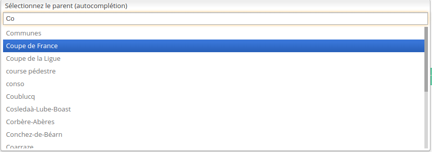
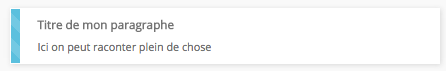

**SDV** Ng2 Widget est un pack de widget adapté pour bootstrap en angular2

Les widgets génériques sont définis dans le paquet [sdv-ng2-widgets](https://gitlab.sdv.fr/rnd/sdv-ng2-widgets)

# Autocomplete



Le composant d'autocomplete doit être appelé de la façon suivante:

    <autocomplete [config]='...' [data]='...' (valid)="function($event)"></autocomplete>

* **[data]**: *Array* - tableau contenant les données à traiter par l'autocomplete
* **[config]**: *Object* - permet la config du widget, doit contenir:
    * **fieldDisplayed**: *String|Array* - nom du ou des attributs du tableau *data* qui sont utilisés à l'affichage dans le champ
    * **fieldSearch**: *String* - nom de l'attribut du tableau *data* dans lequel effectuer la recherche (si vide, on prend le fieldDisplayed)
    * **fieldValue**: *String* - nom de l'attribut du tableau *data* qui fait office de valeur de retour par le widget (si vide, on renvoi l'objet complet)
    * **fieldInsert**: *String* - nom de l'attribut du tableau *data* qui remplacera le placeholder après un clic sur l'un des résultats (si vide, on insert le fieldDisplayed)
    * **fieldDefault**: *String* - La chaîne affichée lorsque aucune valeur n'est sélectionnée. Vaut Aucun par défault
    * **begin**: *Number* - nombre de caractères à entrer dans le champ avant que l'autocomplete ne se lance
    * **defaultValue**: *String* - valeur par défaut à insérer dans l'input d'autocompletion
    * **placeholder**: *String* - Placeholder du champ
    * **modifyPlaceholder**: *Boolean* - Si true, alors le placeholder prends la valeur du champs sélectionné. Vaut true par défaut.
    * **displayItem**: *Boolean* - Si true, alors on affiche les différents élements que l'on ajoute à droite du placeholder. Vaut false par défaut.
    * **displayItems**: *Array* - Tableau qui contient les différents élements à ajouter à droite du placeholder.
    * **displayItemClass**: *String* - Classe CSS pour les élements à afficher à droite du placeholder.
* **(valid)**: *Function* - fonction appelée lorsque le champ est validé sur un resultat existant.
* **(create)**: *Function* - fonction appelée lorsqu'on fait "ENTREE" sur un texte inexistant.
* **(delete)**: *Function* - fonction appelée lors de la suppression d'un résultat.

# BigDatatable
Ce composant est une solution alternative au composant Datatable. Il permet de gérer une grande quantité de données.
Il utilise le composant **Pager** et le composant **Filtre**, cependant il peut fonctionner sans ceux-ci.
Il est possible de le configurer de tel sorte qu'un filtre soit présent en haut de page, qu'une pagination soit présente en bas et/ou haut de page.
Pour un bon fonctionnement de ce composant, il est néanmois conseillé de disposer d'au moins une pagination.

Ce composant renvoie en valeur de output : (message), qui vaut success ou error selon si on a réussit ou non à récupérer les informations côté serveur.

La configuration est la suivante :

* **bigdata**
    * **_service** : Le service qui s'occupera d'aller chercher les données sur le serveur.
    * **_service_method : La fonction qui est appellée par le **_service** pour récupérer les données.
    * **filter_has_display_items** - **boolean** - **default = false** : Si true, alors on peut changer le nombre d'élement par page dans le filtre
    * **display_items_name** - **string** - **default = display_items** : Nom du champs qui contient le nombre d'élement par page dans le filtre (sa **key**).
    * **is_filter** - **boolean** - **default = true** : Si false, alors on a pas de filtre.

    * **filter_config** - **Array** : Correspond à **config** de **Filtre**. Voir sa configuration.
    * **tr** -Object** : Contient soit une propriété :
        * **class** : La classe à appliquer sur les tr
        * **function** : Une fonction qui sera appliquée sur **parent_scope** qui renvera la classe à appliquer sur le tr.

    * **pagination_config** - **Array** - **FACULTATIF** : Si non renseignée, la pagination par défaut sera appliquée.
        * **pagination_top** - **boolean** - **default = false** : Si true, alors on aura une pagination en haut de page.
        * **pagination_bottom** - **boolean** - **default = true** : Si true, alors on aura une pagination en bas de page.
        * **page** - **number** - **default = 1**: La page courante.
        * **max_page** - **number** - **default = 1** : Le nombre de page qu'il y a en tous.
        * **delta** - **number** - **default = 5** : Le nombre de page précédent et suivant **page** que l'on vera à l'écran.
        * **item_per_page** - **number** - **default = 10** : Le nombre d'élement que l'on veut afficher sur chaque page.

    * **buttons** - **Array** - **FACULTATIF**: Tableau de tableau contenant les boutons. Un tableau se compose de la façon suivante :
        * **text** - **string** : Le texte qui sera dans le boutons, peut être du HTML.
        * **class** - **string** : La classe qui sera associé au bouton.
        * **action** : La méthode qui sera appellée lors du clic sur le bouton. Sera appliquée sur **parent_scope**

* **parent_scope** : Le composant parent.

* **structure** - **Array** : Correspond à la structure des colonnes. Chaque colonne peut être configurée différement,
plusieurs types de colonne existent, pour les différencier un attribut **state** a été mit en place. Cet attribut peut avoir plusieurs valeurs :
* 1 est l'état "normal", ou le contenu sera affiché tel quel dans la cellule.
* 2 est l'état "html", ou le contenu est sous forme HTML.
* 3 est l'état "avancé", une fonction est déclenché lors du clic sur l'élement.

Chaque colonne est matérialisée par un tableau dans **structure**, les propriétés communes pour ces tableaux sont les suivantes :
* **id** - **string** : Correspond à la propriété de l'objet qui sera contenu dans la big-datatable.
* **label** - **label** : Correspond au titre de la colonne.
* **size** - **number** - **FACULTATIF** : Correspond à la taille en % de la colonne (attention seul les valeurs 1,2,3,5,7,15,20,25 sont mises en place).
* **state** - **number** - **default = 1** : Correspond à l'état de la cellule tel que décris ci-dessus.

Propriété supplémentaire selon l'état :
* **state == 1 || state == 2** : On peut lui passer une pipe en paramètre, pour ce faire :
    * **pipe** : C'est l'objet Pipe qu'on lui passe.
    * **params** : C'est les paramètres à passer à **pipe**.
    * **pipe_async** - **boolean** : Permet de signifier qu'un pipe est asynchrones.
    * **pipe_async_field**- **string** : Si le pipe asynchrone renvoie un objet, le champ précisé ici sera affiché.

* **state == 3** : On peut lui passer une fonction qui se déclenchera lors du clic sur lui et également split la value de la cellule.
    * **function_type** - **string** : Vaut soit 'normal', soit 'split', soit 'content'. Si split, on doit passer un separator en paramètre.
    * **separator** - **string** - **OBLIGATOIRE SI function_type == 'split'**: Le séparateur pour le split sur la valeur de la cellule.
    * **class** - **string** : Une classe CSS à appliquer sur le contenu de la cellule.
    * **function** :
        * Si function_type vaut 'split' ou 'normal', il s'agit de la fonction à appliquer lors du clic sur le(s) élement(s) de la cellule.
        * Si function_type vaut 'content', il s'agit de la fonction à appliquer à l'affichage du contenu de la cellule.

Exemple de structure :

        structure:                                              // La structure du tableau.
        [
            // Champs avec une pipe :
            { id: "url_source",        label: "URL Source",    size: 15, pipe: new TruncateWithTooltipPipe, params: 50, state: 2},

            // Champs "normale" :
            { id: 'redirection_label', label: 'Redirection',   size: 11},

            // Champs avec function :
            { id: 'tags_list',         label: 'Tag(s)',        size: 10, function_type: 'split', separator:',', class:'tag_list hover', function: this.addFilterTag, state:3},
        ],


Pour l'instancier :

    import {BigDatatable} from 'sdv-ng2-widgets/_widgets/big-datatable/big-datatable.component';
    [...]
    this.bigdata = new BigDatatable(this.config, this.structure, this.scope);

Les données qui sont postées côté serveur sont un tableau associatif contenant :

array(
    'filter' =>  toutes les données du filtre.
    'pagination' => toute la pagination.
);

Le serveur doit impérativement renvoyer un tableau JSON sous cette forme :

    array('filter' => $filter['filter'],
          'objects' => $res['shortcuts'],
          'pagination' => $filter['pagination']
          )

# Bloc-Card

Bloc de contenu sous forme de carte



    <bloc-card class="col-lg-4" [data]="{type:'divers', title:'Titre de mon paragraphe', content:'Ici on peut raconter plein de chose'}"></bloc-card>

* **title**: pour changer le titre du bloc
* **content**: pour changer le contenu du bloc
* **type**: peut prendre la valeur: paragraphe, image, divers, autre2, autre3 (ceci le fera changer de couleur)

# BreadCrumb ( Fil d'ariane )

Ce widget ne doit s'intégrer qu'une fois dans la page.
Pour son utilisation voir à travers le service [BreadCrumb](#breadcrumb-fil-dariane_1)

# Button 3D

Permet de faire des boutons poussoir en 3d


Utilisation :

    <button3d [icon]="'check'" [class]="'success'" [size]="'btn-sm'" (click)="afficheBootbox('alert')" > Valider</button3d>
    <button3d [icon]="'code-fork'" [class]="'danger'" (click)="afficheBootbox('alert')" > Pousser en prod</button3d>
    <button3d [icon]="'cloud'" [class]="'primary'" [size]="'btn-lg'" (click)="afficheBootbox('alert')" > Envoyer dans le cloud</button3d>

# Chevron

Le widget chevron permet de cacher facilement le contenu d'un bloc


* **hidden** : Input/Ouput: Etat ouvert/fermé du bloc lié (boolean)

Exemple1: Utilisation avec une var locale et le display hidden (caché par la css) :

    <h3>
      <chevron [(hidden)]='contenu.hidden' class="pull-right"></chevron>
      Titre
    </h3>
    <div #contenu>
      Mon contenu a cacher
    </div>

Exemple2: Utilisation avec une var typescript et ngIf (caché par le dom/js):

`public mavar: boolean = false;`

    <h3>
      <chevron [(hidden)]='mavar' class="pull-right"></chevron>
      Titre
    </h3>
    <div *ngIf='mavar'>
      Mon contenu à cacher
    </div>

# CKEditor

Le widget ckeditor permet d'intégrer l'éditeur de texte simplement.


Utilisation :

    <ckeditor [(content)]="article.chapeau" [id]="'chapeau_text'"
              [rows]="4" [disabled]="false" [config]="config1"></ckeditor>

* **content** : Le texte contenu par l'éditeur, lié dans les deux sens afin de  mettre à jour automatiquement la variable dans le composant appelant
* **id**: Un identifiant unique pour l'éditeur.
* **row**: Permet de définir la hauteur de l'éditeur.
* **disabled**: Si il est à true, le ckeditor est remplacé par une div affichant juste le contenu.
                S'il est passé à false par la suite, le ckeditor apparaitra.
* **config**: La configuration de l'éditeur (choix des actions possibles ou non).

Exemple de conf, voir le fichier site/bo_spa/src/app/article/edit/edit.ts

# Corner button

A documenter

# Datatable


Exemple de template:

    <loader [condition]="data_tab">
      <datatable [data]="data_tab" [structure]="structure" [buttons]="buttons" [parent_scope]="scope"></datatable>
    </loader>`

Exemple de component:

    public structure = [
        { id: "id", label: "ID"},
        { id: "name", label: "Nom du champ"}
    ];

    public buttons = [
      {
          text: 'Editer',
          action: this.edit,
          class: "btn btn-warning"
      },
      {
          text: 'Supprimer',
          action: this.confirmDelete,
          class: "btn btn-danger"
      }
    ];
    //scope sur lequel appliquer les fonctions des boutons
    public scope = this;

    //un exemple de données
    public data_tab = [{id: 1, name: "Antoine"}];

Il est également possible de fournir du contenu HTML généré dynamiquement, pour ce faire :

 - La définition de la structure est la suivante :


    public structure = [
        { id: "id", label: "ID"},
        { id: "liste_lapins", label: "Mes Lapins", inputHTML: true}
    ];

 - Ensuite, dans mon model :
        1) Ajouter la propriété "liste_lapin".
        2) Générer le HTML qui corresponds.
        3) L'affecter à cette propriété.


    # dans mon model :
    public lapins: Lapin[]; // Les différents objets Lapin

    # Dans le constructeur du model :
    this.lapins      = obj && obj.lapins     || null;

    public get liste_lapins() {
        let ul = '<ul>';
        for(let lapin in this.lapins) {
            ul += '<li>' + lapin.name + '</li>';
        }
        return ul + '</ul>';
    }

# DatePicker

Ce widget permet d'afficher un champ de texte qui fait apparaître un calendrier.


Utilisation :

    <datepicker [(ngModel)]="date_publi" view-format="DD/MM/YYYY" model-format="YYYY-MM-DD"
                first-week-day-sunday="false"></datepicker>

* **ngModel**: La valeur de le date.
* **view-format**: Le format de date tel qu'il sera affiché dans le champ de texte.
* **model-format**: Le format de la date tel qu'il est dans la variable.
* **first-week-day-sunday**: Un booléen permettant de préciser pour l'affichage du calendrier si les semaines doivent commencer le dimanche (true) ou le lundi (false).

# DropDown

A documenter

# Filtre
Ce composant permet de générer un filtre. Ce filtre possède deux états :
 * un état simple, où seulement un champs de recherche est présent.
 * un état avancé, où plusieurs champs de recherche sont présent selon ce qui a été configuré.

La configuration est la suivante :
* **config**
    * **advanced_mode** - **boolean** - **default = false** : Si true, alors le filtre sera dans l'état "Filtre avancé".
    * **global_search** - **string** - **default = ''** : Le texte qui est dans l'input de recherche lorsque le filtre es dans l'état "Filtre simple".
    * **callback**      : La fonction qui sera appellée lors de la validation du filtre. Sera appliquée sur **parent_scope**
    * **parent_scope**  : Le composant parent qui contient la méthode **callback**.
    * **order_by_column** - **string** - **default = id** : Le champs en base sur lequel l'order by sera appliqué.
    * **order_by_type**   - **string** - **default = ASC** : Si l'order by est croissant ou décroissant.
    * **config_column** - **Array<number>** : Tableau contenant la taille bootstrap des différentes colonnes.
                                              Par exemple [4,8] => On aura une colonne avec ce style "col-lg-4" et la deuxième aura "col-lg-8".
                                              **Attention le maxium des sommes des colonnes doit faire 12 !!!**
    * **hide_search** - **boolean** - **default = false** : Si true, alors le filtre de recherche globale sera caché lorsqu'on est en recherche avancé.
    * **property** - **Array** : Tableau contenant les différentes propriétés sur lesquelles on peut filtrer.

**property** est un tableau associatif, qui est formé de la manière suivante :
    * **key** : **data (Array)** : **key** est le nom du champ tel qu'il l'est en BDD.

**data** est un tableau contenant les différentes configurations pour le champs **key**. La configuration diffèrent selon le type de champ.
Actuellement les différents champs possible sont :
 * text
 * number
 * autocomplete
 * select
 * date
 * intervalle de date

 Pour chacun de ces types, data doit contenir :
 * **id** - **string** : C'est l'id du champs.
 * **label** - **string** : C'est le label du champs.
 * **type** - **string** : C'est le type du champs. Ce type est un de ceux décrit ci-dessus.
 * **value** - **<any>** : La valeur par défaut de ce champ. Peut être une chaîne, un nombre, un tableau....
 * **column** - **number** : Le numéro de la colonne dans lequel ce champ se trouvera.

 Configuration de data supplémentaire pour **data.type ==**:
 * **text** : AUCUNE.

 * **number** :
    * **min** - **number** - **FACULTATIF** : La valeur minimum possible pour ce champ.
    * **max** - **number** - **FACULTATIF** : La valeur maximal possible pour ce champ.

 * **autocomplete** :
    * **config** - **Array** =====> Se référer à la documation concernant le widget "Autocomplete".
    * **delete** : La méthode qui sera délenchée lors de la suppression d'un élement de l'autocomplete.
                   Cette méthode sera appliquée sur **parent_scope** (celui du filtre).
    * **add** : La méthode qui sera déclenchée lors de l'ajout d'un élement de l'autocomplete.
                Cette méthode sera appliquée sur **parent_scope** (celui du filtre).
    * **data** : Les données qui seront fournies à l'autocomplete.

 * **select** :
    * **propositions** - **Array** - Tableau d'objet qui contient les différents élements à insérer dans le select.
                                     Ce tableau doit correspondre au format suivant : { label: 'label', id : 'id' }, où id est la value.
    * **default_label** - **string** - **FACULTATIF** : Le label de la proposition par défaut.
    * **default_value** - **any**    - **FACULTATIF** : La valeur de l'option par défaut.

 * **date** : Aucune, par contre **value** doit être une date au format **YYYY-MM-DD** !

 * **date-intervale** : Aucune, par contre **value** doit être composé comme ça :
    * **{'min' : '2000-01-01', 'max': '2015-05-05'}** où **min** et **max** sont au format **YYYY-MM-DD**.


# Graph

A documenter

# Hierarchie List

Ce widget permet de faire une hierarchisation d'éléments en plusieurs volets qui s'ouvrent l'un à côté de l'autre.

Utilisation:

`<hierarchie-list #treeview [datas]="current_topics" [params]="params" ></hierarchie-list>`


* **datas** sont les données à mettre en forme dans le widget
* **params** sert à configurer l'arbre :
    * **name_column**: le nom de l'attribut qui sera affiché
    * **primary_key**: l'attribut servant d'identifiant
    * **root_id**: l'identifiant de l'élément servant de racine à l'arbre
    * **scope**: Le contexte d'appel pour les fonctions utilisées dans les boutons et checkboxes
    * **buttons**: un tableau de boutons affichés pour chaque élément de l'arbre
        * **class**: Les classes à affecter au bouton
        * **text**: Le texte (ou html) qui sera affiché dans le bouton
        * **action**: L'action à effectuer au clic sur le bouton

# Loader

Le widget loader permet de cacher facilement le contenu d'un bloc durant son chargement


* **condition** : condition d'affichage de la roue de chargement, quand la condition est vrai on affiche le ng-content,mais tant que la condition est false on affiche le loader
* **type** : Facultatif, Type de template d'affichage pour le widget, de base est une div, mais peut etre de type **list** ou **panel**

Exemple:

    <loader [condition]="!ready" [type]="'panel'">
      Mon Contenu
    </loader>

# Menu interne

Ce widget permet d'ajouter un second niveau de navigation, à l'intérieur d'un widge de page.


Il se définit en lui fournissant au moins une liste d'item, exemple:
```
    import {MenuItem, MenuItemBadge} from "sdv-ng2-widgets";
    ...
    private menu_items = [
      new MenuItem({
        icon: "inbox",
        title: "Inbox",
        badge: new MenuItemBadge({
          class: "success",
          number: 19
        })
      }),
      new MenuItem({
        icon: "star",
        title: "Starred",
        badge: new MenuItemBadge({
          class: "warning",
          number: 2
        })
      }),
      new MenuItem({
        icon: "star",
        title: "More",
        subitems: [
          new MenuItem({
            title: "Spam",
            badge: new MenuItemBadge({
              class: "warning",
              number: 2
            })
          }),
          new MenuItem({
            title: "Trash"
          })
        ]
      })
    ];
```
et dans la template:
```
    <menu_interne
      [items]="menu_items"
      [title]="'Gestion Multi-Média'"
      (select)="menuClick($event)"
      [icon]="'plus'"
      [tooltip]="'Exporter vers un media'"
      (button)="newMedia($event)"
      (toggle)="menuToggle($event)">
    </menu_interne>
```

* **[items]**: *Array<MenuItem>* - Une entrée du tableau correspond à un element de la liste, on peut y ajouter des 'subitems' pour un niveau supplémentaire
* **[title]**: *string* - Titre du menu
* **(select)**: *EventEmitter<MenuItem>* - renvoie l'item selectionné lors d'un clic
* **[icon]**: *string* - classe d'icône du bouton de droite
* **[tooltip]**: *string* - texte au survol du bouton de droite
* **(button)**: *EventEmitter<boolean>* - renvoie true lors d'un click sur le bouton de droite
* **(toggle)**: *EventEmitter<boolean>* - renvoie l'état (true= ouvert, false= fermé) du menu lorsqu'on le ferme/ouvre

# Pager

Utilisation:
`<pager [pager]="pager"></pager>`

* **pager**: L'objet contenant la configuration du pager a appelé en utilisant le constructeur du Pager
    * **scope**: Le contexte d'appel du pager
    * **quantity**: Le nombre d'éléments total
    * **per_page**: Le nombre d'éléments par page
    * **delta**: Le nombre de boutons de numéros de page affichés
    * **actionCallback**: La fonction à appeler au clic sur  un des boutons du pager

# Pagination

La pagination permet de générer une pagination.
 * **item_per_page** - **number** - **default = 10** : Le nombre d'élement que l'on veut afficher sur chaque page.
 * **page** - **number** - **default = 1** : La page courante.
 * **max_page** - **number** - **default = 1** : Le nombre de page qu'il y a en tous.
 * **callback** : La fonction à appeller en cas de changement de page, cette fonction sera appellée sur **parent_scope**.
 * **parent_scope** : L'élement sur lequel la fonction **callback** va s'appliquer.
 * **delta** - **number** - **default = 5** : Le nombre de page précédent et suivant **page** que l'on vera à l'écran.


Exemple d'appel dans un template :

    <pagination [max_page]="max_page"
                [item_per_page]="item_per_page"
                [page]="page"
                [delta]="delta"
                [parent_scope]="scope"
                [callback]="callback">
    </pagination>

# Progress Bar

Permet d'afficher facilement une barre de progression qui change de couleur en fonction du taux d'avancement

Utilisation:

      <progress-bar [datas]="{
            value : article.avancement,
            min_value : 0,
            max_value : 100
        }" [class]="'progress-bar-striped'" class="col-md-8 control-label"></progress-bar>

* **datas**: Un objet comprenant la valeur de la progress-bar, ainsi que ses valeurs minimum et maximum
* **class**: Des classes particulières à ajouter à la progress-bar

# Status Bar

Permet de faire une notification de status ressemblant à growl


Utilisation :

    <status-bar [icon]="'refresh'" > Mise à jour disponible </status-bar>
    <status-bar [icon]="'folder-open-o'" [class]="'info'" > Mise à jour disponible </status-bar>
    <status-bar [icon]="'warning'" [class]="'warning'" > Mise à jour importante disponible </status-bar>
    <status-bar [icon]="'warning'" [class]="'danger'" > Mise à jour critique disponible </status-bar>

# Switch

A documenter

# TabPane ( Onglets )


Le composant doit figurer dans le template  de la façon suivante :

     <tabpane>
         <tab [tabtitle]="...">
           <mon-autre-component></mon-autre-component>
         </tab>
         <tab [tabtitle]="...">
           code html
         </tab>
     </tabpane>

 * **tabpane** sert à encadrer la liste des onglets qui seront regroupés
 * **tab** sert à définir un onglet en particulier
    * **[tabtitle]** est le titre que portera l'onglet
    * Chaque balise tab peut contenir du html ou des composants Angular

# Touch Button

Permet de créer un bouton flottant de style "polymere", contenant plusieurs autres boutons


Utilisation:
<touch-button>
<tb-link [icon]="'phone'" (tbclick)="notif('phone')"></tb-link>
<tb-link [icon]="'envelope-o'" (tbclick)="notif('envelope-o')"></tb-link>
<tb-link [icon]="'pencil'" (tbclick)="notif('pencil')"></tb-link>
</touch-button>


# Treeview

Le treeview permet d'avoir un vue hierarchique d'élement sous forme d'arbre dépliable.

Utilisation:
`<treeview [datas]="menu" [params]="params"></treeview>`

* **datas** sont les données à mettre en forme dans l'arbre
* **params** sert à configurer l'arbre :
    * **name_column**: le nom de l'attribut qui sera affiché
    * **primary_key**: l'attribut servant d'identifiant
    * **root_id**: l'identifiant de l'élément servant de racine à l'arbre
    * **scope**: Le contexte d'appel pour les fonctions utilisées dans les boutons et checkboxes
    * **buttons**: un tableau de boutons affichés pour chaque élément de l'arbre
    * **checkbox**: un objet permettant de configurer une checkbox devant chaque élément de l'arbre :
        * **column_value**: La valeur utilisée pour la checkbox
        * **checked**: un liste d'identifiant d'éléments déjà cochés
        * **action_on_change**: une fonction à appeler quand on coche ou décoche une checkbox
        * **action_validate**: une fonction à appeler quand on valide les cases cochées

# Wizard

  a documenter
